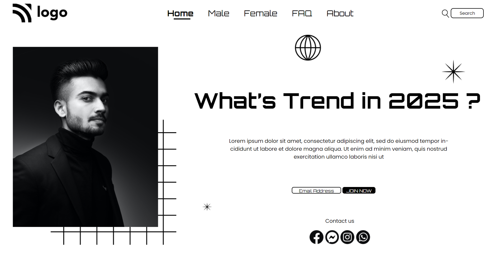

# Hey Welcome 

I'm Azam Shaikh, a laravel backend Developer, and Passionate to become a Full Stack Developer.

## Project Name : **Street Style Landing Page**

In this project i have created a Street Style landing page. And i have learnt a lot of things of like how to use flex and how css makes life easier, and i have also learnt about positions like absolute and relative in this project.

 

# 💻 Tech used
 

 

### My Project is looking like :

## Time taken to finish this project

### You can Check it Live on Below Link :

[Live Link !]()
